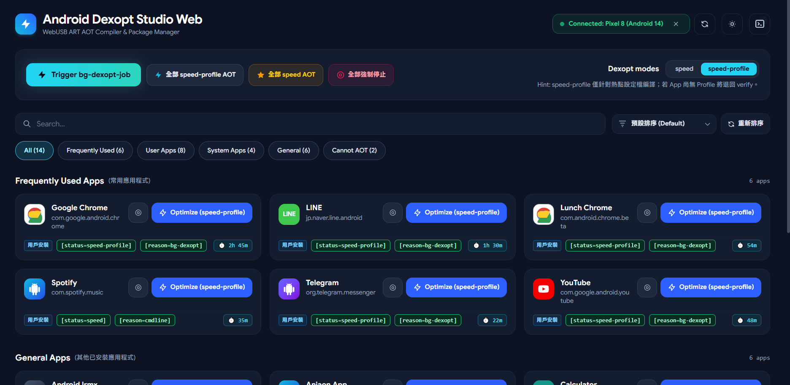
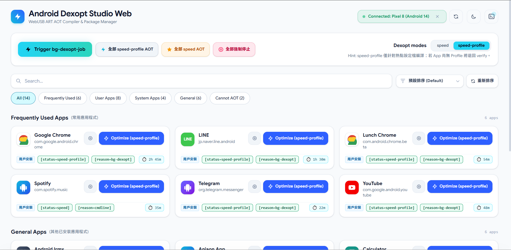

# Android Dexopt Studio Web (WebADB ART 效能最佳化工具)

[](https://github.com/abc0922001/android-dexopt-web/actions/workflows/deploy.yml)
[](LICENSE)

純前端 WebADB Android ART Dexopt 效能最佳化管理工具。透過瀏覽器 WebUSB API 與 Android 裝置進行 ADB 通訊，提供視覺化的 ART 編譯狀態檢視、常用度與使用時間智慧排序、用戶/系統分類、單一/批次 App 手動編譯（`speed` / `speed-profile`）、應用程式強制停止（Force Stop），以及全局觸發系統級 `bg-dexopt-job`。

---

## 🌟 核心功能特色

* **純靜態單頁應用 (SPA)**：無需在電腦安裝 Python、Node.js 伺服器或 Android SDK 命令列工具，直接使用支援 WebUSB 的現代瀏覽器（Chrome、Edge、Brave、Opera）即可操作。
* **高階智慧分層掃描 (Smart App Categorization)**：
  * **常用應用 (Frequently Used)**：智慧評分整合 `dumpsys usagestats` 前景活躍度統計與桌面啟動器（Launcher）活動，精準收錄最常用的 20~25 款核心應用，並標註近期前景使用時間（如 `⏱️ 1h 30m`）。
  * **用戶安裝應用 (User Apps)**：自動區隔使用者自 Google Play 或手動安裝的第三方應用程式。
  * **系統內建應用 (System Apps)**：清晰識別系統預載與底層架構應用程式。
  * **一般應用 (General)**：完整收錄其餘可進行 AOT 編譯的背景服務與工具程式。
  * **不支援 AOT (Cannot AOT)**：自動識別純資源包、無程式碼模組（`hasCode=false`）、主題覆蓋包（Overlay）與無 Dex 檔案之套件。
* **一鍵批次 AOT 編譯 (Batch Optimization)**：
  * 支援「全部 speed」與「全部 speed-profile」批次編譯。
  * 提供彈性操作範圍選擇（僅用戶安裝 App、僅系統 App、或全部 App）與防誤觸確認對話框。
  * 即時進度條（百分比、目前處理應用名稱、成功/失敗計數）與隨時中斷（Cancel）機制。
  * 批次編譯效能最佳化：編譯過程略過單一 App 逐次查詢，全部完成或中途取消時統一單次批次同步最新狀態。
* **應用強制停止 (Force Stop - `am force-stop`)**：
  * 單一卡片與頂部批次雙重支援，點擊後彈出安全確認視窗。
  * 迅速終止目標應用的進行中進程與快取服務，確保下次啟動時立即重新載入全新編譯的 AOT 最佳化機器碼。
* **彈性排序與卡片穩定就地更新 (Stable In-place Update & Flexible Sorting)**：
  * 支援多種排序維度：預設排序、狀態 Unknown 優先、狀態 Speed 優先、名稱 A→Z、使用時間 高→低。
  * 排序由使用者明確觸發，並提供專屬「🔄 重新排序」按鈕。
  * 單一或批次編譯完成後，卡片維持於原位置就地更新狀態與標籤，避免清單突發性跳動移位。
* **智慧狀態降級與按鈕指引 (Smart Button Fallback)**：
  * 若在 `speed-profile` 模式下因尚無 Profile 暫退回 `verify`，系統將自動把該 App 的按鈕切換為醒目的琥珀色 `Optimize (speed)`，方便一鍵補行完整編譯。
* **寬螢幕最佳化排版 (Wide-screen & Ultrawide Responsive)**：
  * 針對 21:9 超寬螢幕（如 2560×1080）與各類解析度進行格線自適應優化，完整呈現長名稱與套件名稱不截斷。
* **雙重編譯模式選擇器 (Dexopt Mode Selector)**：
  * **`speed`**：完整 AOT 編譯所有位元碼，啟動速度最快，但消耗較多儲存空間。
  * **`speed-profile`**：依據 JIT 熱點設定檔進行重點編譯，平衡空間與效能（同系統預設）。
* **全域系統排程控制**：支援一鍵觸發 Android 系統級 `bg-dexopt-job`，並提供隨時中斷任務（`cancel-bg-dexopt-job`）機制。
* **即時終端輸出抽屜 (Live Terminal Drawer)**：即時串流顯示所有 ADB 指令輸出、執行時間與狀態，支援一鍵複製與清空。
* **明暗雙色主題 (Dark / Light Mode)**：完美適配高對比深色與淺色精緻介面，自動偵測系統喜好並持久化設定。
* **內建模擬示範模式 (Interactive Demo Mode)**：即便手邊暫無實體 Android 裝置，也能立即一鍵進入模擬環境，體驗完整操作流程。

---

## 📸 視覺介面預覽

| 深色模式 (Dark Theme) | 淺色模式 (Light Theme) |
| :---: | :---: |
|  |  |

---

## 🛠️ 本地開發與建置

### 前置需求
* Node.js 18+ 或更高版本
* npm 9+

### 常用指令

```bash
# 1. 安裝相依套件
npm install

# 2. 啟動本地開發伺服器 (支援熱重載)
npm run dev

# 3. 執行單元測試
npm test

# 4. 建置靜態發布包至 dist/
npm run build

# 5. 本地預覽生產建置成果
npm run preview
```

---

## 🚀 部署至 GitHub Pages

本專案已配置好標準 GitHub Actions 自動部署腳本（[`.github/workflows/deploy.yml`](.github/workflows/deploy.yml)）。

1. 將本儲存庫推送至 GitHub 的 `main` 分支。
2. 進入 GitHub Repository **Settings** > **Pages**。
3. 在 **Build and deployment** > **Source** 下拉選單中選擇 **GitHub Actions**。
4. 部署工作流完成後，即可在 `https://<YOUR-USERNAME>.github.io/<REPO-NAME>/` 上直接使用！

---

## 📱 Android 手機連線指引

1. **開啟開發人員選項**：
   * 前往手機【設定】>【關於手機】> 連續快速點擊「版本號碼」7 次，直到出現「您已成為開發人員」。
2. **啟用 USB 偵錯**：
   * 前往【系統】>【開發人員選項】> 開啟「USB 偵錯」。
3. **USB 連接與授權**：
   * 將傳輸線連接至電腦。
   * 在網頁右上角點選「連接裝置 (Connect)」。
   * 手機螢幕會跳出提示視窗，請務必勾選「永遠允許這台電腦進行偵錯」並按下「確定」。

### 常見問題排查

* **出現 `claimInterface` 或連線介面被鎖定**：
  * 若電腦本機已安裝 Android Studio 或背景正在運行 `adb` 伺服器，可能導致 WebUSB 接口被佔用。
  * 請在電腦終端機輸入：`adb kill-server` 後重試連線。
* **瀏覽器不支援**：
  * WebUSB API 僅支援 Chromium 核心瀏覽器（Google Chrome、Microsoft Edge、Brave、Opera 等）。
  * 瀏覽器安全性規範要求必須於 HTTPS 或 `localhost` 環境下才能存取 WebUSB。
* **編譯為 `speed-profile` 後狀態顯示 `[status=verify]`**：
  * 代表該應用程式尚未在手機上累積足夠的使用記錄（Profile 未就緒），ART 編譯器會自動退回 verify。
  * 系統會自動為該 App 切換按鈕為琥珀色的 `Optimize (speed)`，再次點擊即可強制進行無條件的完整 AOT 編譯。
* **強制停止 (Force Stop) 的功用**：
  * Android 應用在背景運行或快取中時，即使完成了 AOT 編譯，記憶體中仍可能在執行未最佳化的舊進程。
  * 使用卡片上的「強制停止」按鈕終止該應用，能確保下次啟動時直接重新載入最新編譯的機器碼。

---

## 📄 開源授權

本專案基於 [MIT License](LICENSE) 條款開源。
